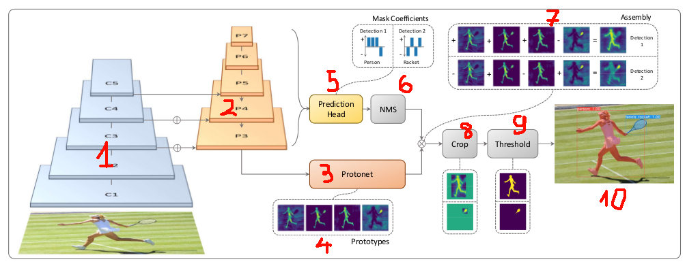
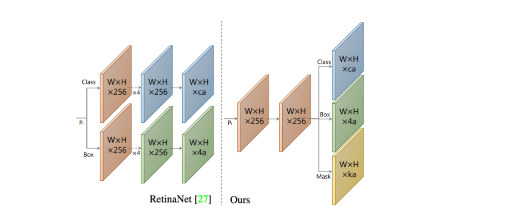
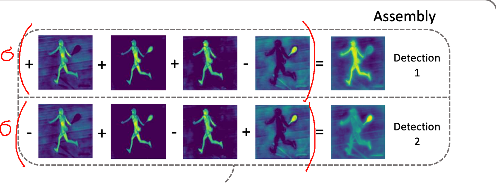

# YOLACT for Xray segmentation
## Table of contents
- [Introduction](#Introduction)
- [YOLACT: Real-time Instance Segmentation](#YOLACT)
- [YOLACT++: Better Real-time Instance Segmentation](#YOLACT++)
- [Result](#RESULT)

## Introduction :smile:
A simple, fully convolutional model for real-time instance segmentation. This is our implementation based on [https://github.com/dbolya/yolact](https://github.com/dbolya/yolact) for our Xray images dataset.

See the original papers:
- [YOLACT: Real-time Instance Segmentation](https://arxiv.org/abs/1904.02689)
- [YOLACT++: Better Real-time Instance Segmentation](https://arxiv.org/abs/1912.06218)]

Now, let's see how it works.

## YOLACT: Real-time Instance Segmentation
For the current example segmentation method, basically, an instance segmentation module is added to the two-stage target detection algorithm, just like mask-rcnn, but due to multiple repools of feature, the speed is very slow. Yolact's improvement is based on one-stage target detection algorithm.

Yolact is built with the backbone of Retina: Resnet + FPN(Feature Pyramid Network) as you can see part 1 and 2 in the picture. 

Come after that, there are two main modules for instance segmentation: Prototype Net(part 3) and Prediction head(part 5)

### Prototype net
The Prototype net is similar to a module that uses FCN(Fully Convolution Net). It uses features of FPN-P3 to give us K prototype masks with the size upsampled.

The difference is that without using mask loss, only use the loss when the asset is at the end of the network.

### Prediction head, Mask Coefficients
Some object detectors like: RestinaNet, Faster-RCNN often return 2 predict branchs:
- Predict C class confidences.
- Predict bounding box 4 offset for each anchor box

Yolact add a branch that predicts K mask coefficients for each anchor box. This branch's activation function is Tanh fucntion so that, the output can be in [-1, 1]

### Mask Assembly
After NMS(Non-maximum suppression), the bboxes that duplicated is removed.
Then it uses the best bboxes with mask coefficient correspond to predict the set of linear combination coefficients per instance.
The authors use that to create mask for each object.

  

## YOLACT++: Better Real-time Instance Segmentation
In addition to Yolact, the researchers introduce several other improvments that improve performance of inference time in one way or another:
- They propose a new variant of standard non-maximum suppresion called Fast-NMS.
- They introduce deformable convolutions in encoders' backbone network and a novel mask re-scoring branch.

Bellow is an example output image.

